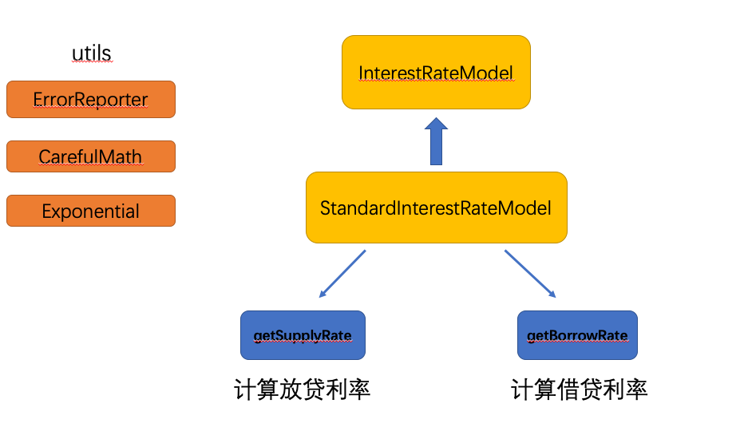
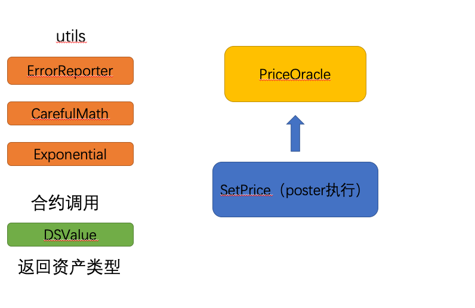
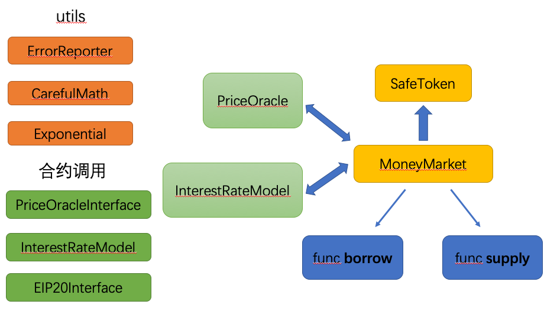

# Compound Code Analyse

### 合约源码分为三个部分:

[1.InterestRateModel](https://github.com/tyGavinZJU/blockChainResearch/tree/master/codeAnalyse/Compound/InterestRateModel.sol)

[2.PriceOracle](https://github.com/tyGavinZJU/blockChainResearch/tree/master/codeAnalyse/Compound/PriceOracle.sol)

[3.MoneyMarket](https://github.com/tyGavinZJU/blockChainResearch/tree/master/codeAnalyse/Compound/MoneyMarket.sol)

### 合约源码的解读:

[1.InterestRateModel解读](https://github.com/tyGavinZJU/blockChainResearch/tree/master/codeAnalyse/Compound/InterestRateModel.md)

[2.PriceOracle解读](https://github.com/tyGavinZJU/blockChainResearch/tree/master/codeAnalyse/Compound/PriceOracle.md)

3.MoneyMarket解读

### 合约框架图：

橙色为工具合约  
绿色为外部合约调用  
黄色为本地合约  
粗箭头为继承  
细箭头为函数调用  

#### InterestRateModel
核心函数为getSupplyRate与getBorrowRate（计算放贷利率与计算借贷利率）

 
 
#### PriceOracle 
 PriceOracle合约为外部动态设置代币价格。合约外部调用DSValue（每一个代币对应一个DSValue地址，需要手动追踪EVM状态树，DAI的DSValue合约地址为0x729D19f657BD0614b4985Cf1D82531c67569197B，该地址为构造函数时输入进去，无法更改）。
 PriceOracle的核心函数为SetPrice，且msg.sender只能为固定预设地址，名为poster（发报员？）
 
 
 
#### MoneyMarket 
 MoneyMarket主合约需要调用上述两个合约，接口分别为PriceOracleInterface与InterestRateModel。MoneyMarket内部核心函数方法为borrow&supply（非常的朴实无华）。这两个函数做了大量的安全判断，内部函数封装，主要处理的是合约间相互调用的生命周期（里三层外三层）
 
 

