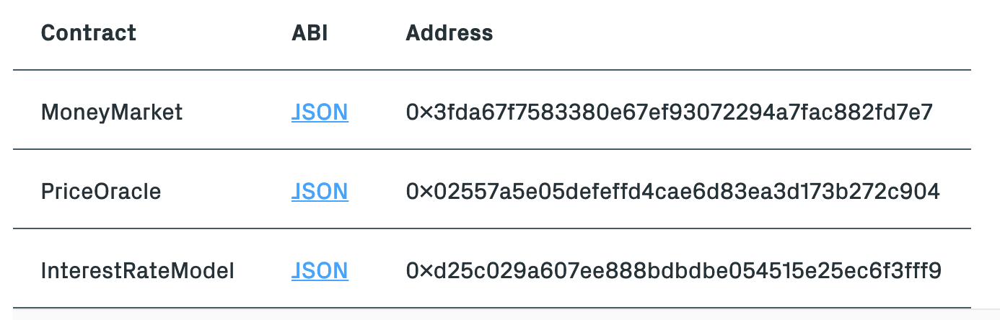

# 19.2.28 区块链金融类项目整理（未分析）

## 稳定币（MakerDAO）
1.BTC并不是通货，而是类似黄金的资产
2.通货的意义在于稳定流通
3.“任何用户可以锁定他们有价值的数字资产，然后生成DAI。系统用动态的目标利率去调节DAI的价格，第一版DAI里，DAI的价格在1:1美元左右浮动”
4.“第二种代币是MKR，也就是Maker。MKR是管理型代币。拥有MKR的用户组成一个去中心化的管理社区，他们决定哪种有价值的数字资产可以作为抵押资产，清算比例等等。作为对他们服务的回报，当用户赎回抵押物的时候，他们不仅要返还 DAI，还要加上一小部分费用，其中一部分费用会被用来购买并销毁MKR以关闭抵押债仓。也就是说MKR是信贷系统的燃料。”

https://mp.weixin.qq.com/s/1HN6k1e8tOwX3uWJIXlrvA

github地址：https://github.com/makerdao

生成DAI的以太坊合约地址：
0x9b0ccf7C8994E19F39b2B4CF708e0A7DF65fA8a3

文档分析：
https://github.com/makerdao/sai

紫皮书 
https://makerdao.com/purple/

## 预测市场（Augur 协议 ）（Veil 应用）
## 去中心化贷款应用

### Bloqboard
https://mp.weixin.qq.com/s/L9THv3aZ1J_QcEQDVTYCLw

###Compound
Compound介绍
https://mp.weixin.qq.com/s/ZejCs01yuYYGULBQd6VYJg

Compound分析
https://mp.weixin.qq.com/s/tkMEHkgodef-bIHgjm7REw

“例如在Dai这个货币市场里，目前放贷可以收取的年利率是2.29%，贷款需要付出的年利率则是8.69%，这些利率对每个人都一视同仁，而且每时每刻都可能处于浮动状态。”

“Compound协议包括三个主要的合约：
MoneyMarket合约：负责主要的借贷逻辑的实现，包括了一系列的操作函数，比如放贷（SUPPLY）、提现（WITHDRAW）、借贷（BORROW）、偿还贷款（ REPAY BORROW ）、 清算（LIQUIDATE）等等。
InterestRateModel合约：提供借贷利率的计算模型。
PriceOracle合约：用来提供各个ERC-20代币的价格信息。比如这个合约可以通过排名前十的交易所得出一个币的当前价格，为其他合约所调用。“

 
https://compound.finance/developers 
里面有详细的开发者需要的内容，例如三个合约的源码api解析
  
 

Compound MoneyMarket truffle 源码
https://github.com/tyGavinZJU/compound-money-market

###NEST
NEST
https://ethfans.org/topics/29118

## 数字博彩资产（Decentraland）

